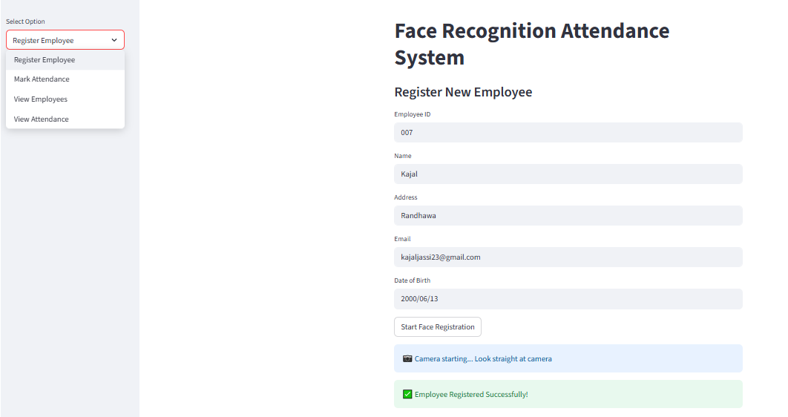
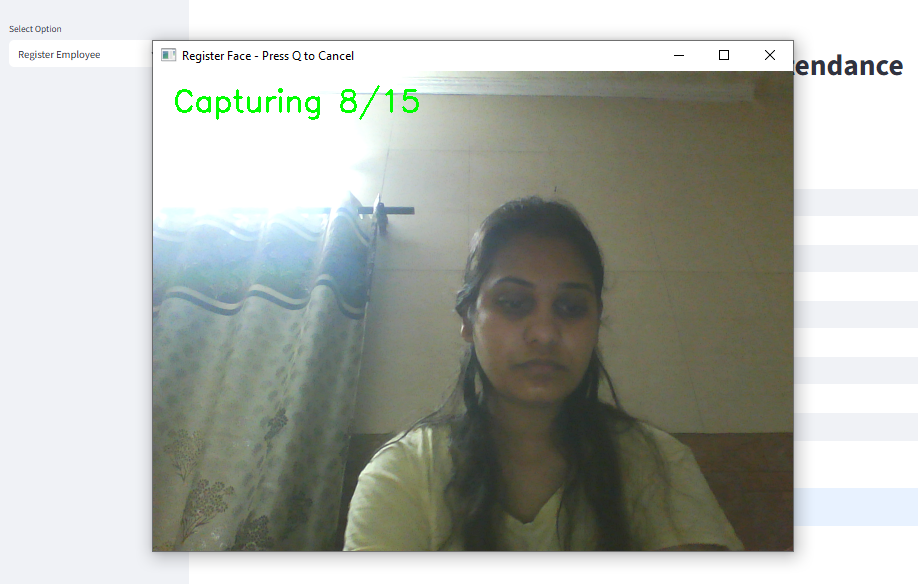
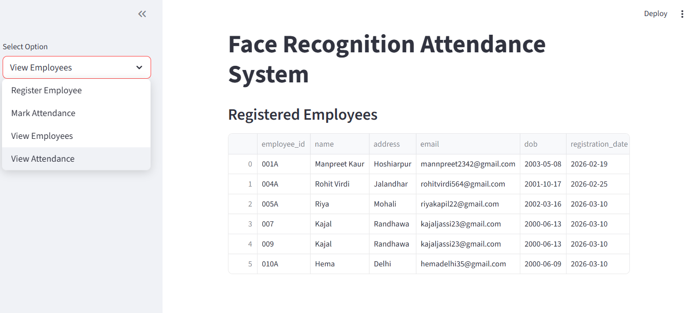
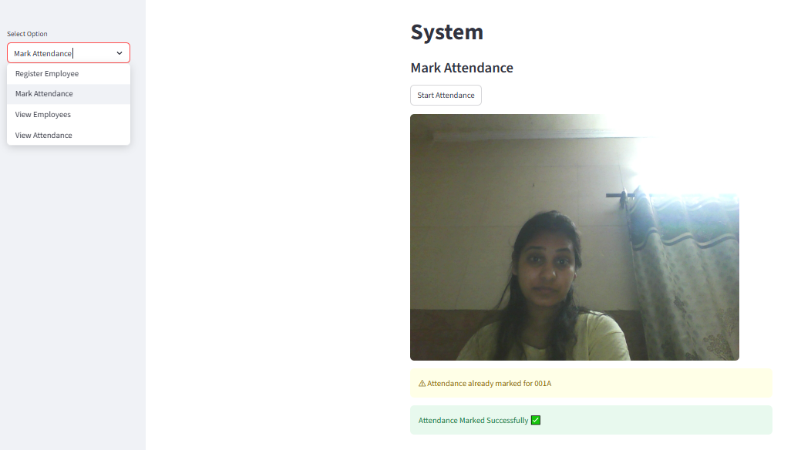
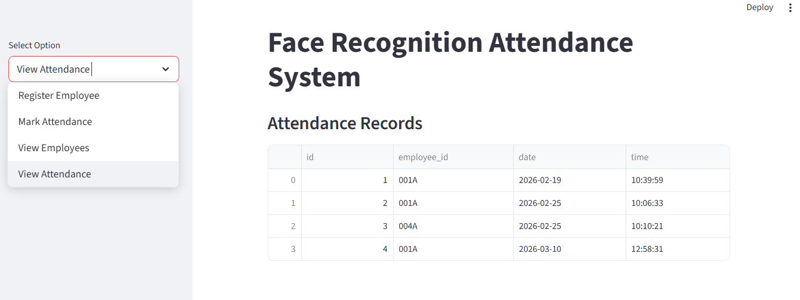
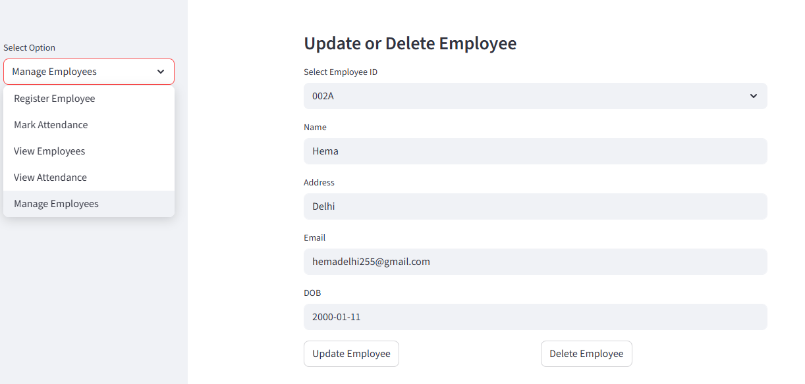

# Face Recognition Attendance System

A **Face Recognition Attendance System** developed using **Python, Streamlit, OpenCV, and FaceNet**.

This system automatically records employee attendance using **real-time face recognition through a webcam**.

Instead of traditional manual attendance, the system detects a person's face, compares it with stored face embeddings, and records attendance in a database.

This project demonstrates the use of **deep learning-based face recognition for practical attendance management**.

# Project Overview

The Face Recognition Attendance System is a computer vision based application developed using Python, Streamlit, OpenCV, and FaceNet. The main objective of this project is to automate the traditional attendance process by using real-time face recognition technology. Instead of manually marking attendance, the system identifies employees through a webcam and automatically records their attendance in a database.

The system works by capturing facial images through a webcam and detecting faces using the MTCNN face detection algorithm. Once a face is detected, the application generates a unique facial representation known as a facial embedding using the FaceNet deep learning model. These embeddings are numerical vectors that represent the distinctive features of a person's face. The generated embedding is then compared with previously stored embeddings of registered employees using cosine similarity. If the similarity score is above a defined threshold, the system recognizes the employee and marks their attendance.

The project includes a user-friendly web interface built with Streamlit, which allows users to easily interact with the system. Administrators can register new employees by entering their details and capturing multiple face samples through the webcam. The system processes these samples and stores the average embedding in an SQLite database along with the employee’s information.

Once employees are registered, the attendance module can identify them in real time and automatically record their attendance along with the date and time. The system also ensures that duplicate attendance entries are prevented for the same employee on the same day.

In addition to attendance marking, the system provides management features that allow administrators to view registered employees, track attendance records, update employee information, and delete employee data when required. The application also allows users to download employee and attendance records in CSV format, which can be opened in spreadsheet tools such as Microsoft Excel for further analysis or reporting.

Overall, this project demonstrates the practical use of deep learning, computer vision, and web-based interfaces to build an intelligent and automated attendance management system.

# Features

* Employee face registration using webcam
* Real-time face detection
* Face recognition using **FaceNet embeddings**
* Automatic attendance marking
* Prevents duplicate attendance for the same day
* View registered employees
* View attendance records
* **Update employee details**
* **Delete employee records**
* Download employee and attendance records as **CSV files**
* Simple and interactive **Streamlit web interface**

# Technologies Used

* Python
* Streamlit
* OpenCV
* PyTorch
* FaceNet (facenet-pytorch)
* MTCNN Face Detector
* SQLite Database
* NumPy
* Pandas

# Project Structure

```
face_recognition_attendance_system
│
├── app.py                # Main Streamlit application
├── register.py           # Employee face registration
├── attendance.py         # Face recognition attendance system
├── detector.py           # Face detection using MTCNN
├── embedding.py          # Face embedding generation using FaceNet
├── similarity.py         # Cosine similarity calculation
│
├── database
│   └── db.py             # SQLite database setup
│
├── requirements.txt      # Project dependencies
├── .gitignore            # Ignored files for Git
│
├── Register_emp1.png
├── face_capture_registration2.png
├── View_emp_reg3.png
├── Mark_attendance4.png
├── View_attendance5.png
├── Manage_emp6.png
│
└── README.md
```

# Installation

Install the required libraries using:

```
pip install -r requirements.txt
```

# Run the Project

Start the Streamlit application using:

```
streamlit run app.py
```

After running the command, open the browser and go to:

```
http://localhost:8501
```

# How the System Works

### 1. Register Employee

* Enter employee details.
* The webcam captures **15 face images**.
* Face embeddings are generated using **FaceNet**.
* The average embedding is stored in the database.

### 2. Mark Attendance

* The system detects a face using **MTCNN**.
* A face embedding is generated.
* Cosine similarity compares the face with stored embeddings.
* If similarity is above the threshold, attendance is marked.

### 3. View Records

* View all registered employees.
* View daily attendance records.
* Download employee and attendance data as **CSV files for reporting**.

### 4. Manage Employees

The system also allows administrators to:

* **Update employee details**
* **Delete employee records**

This helps manage employee data directly from the application interface.

# Application Screenshots

### Employee Registration



### Face Capture During Registration



### View Registered Employees



### Mark Attendance



### View Attendance Records



### Manage Employees (Update / Delete)



# .gitignore

The project uses a `.gitignore` file to prevent unnecessary files from being uploaded to GitHub such as:

* Python cache files
* Virtual environments
* Database files
* Log files
* Temporary files

### Example ignored files

```
__pycache__/
*.pyc
venv/
env/
*.db
*.sqlite3
.env
.ipynb_checkpoints/
.DS_Store
Thumbs.db
*.log
temp/
tmp/
```

# Future Improvements

* Add **liveness detection** to prevent photo spoofing
* Deploy the system on **cloud server**
* Add **admin authentication**

# License

This project is created for **learning and educational purposes**.

# Author

**Manpreet Kaur**
Data Science & Machine Learning Enthusiast
Interested in **Computer Vision, AI Applications, and Web-based ML Systems**


